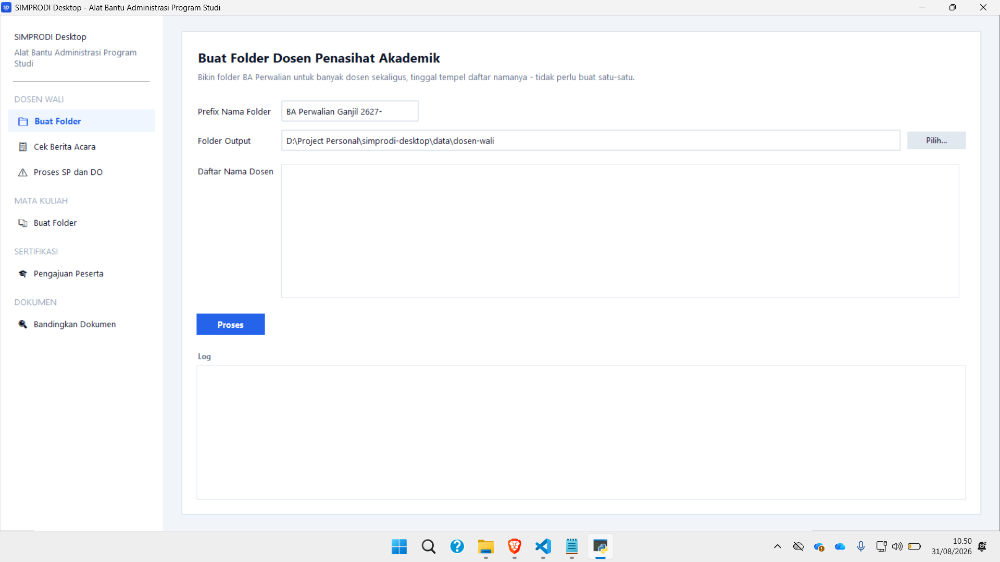
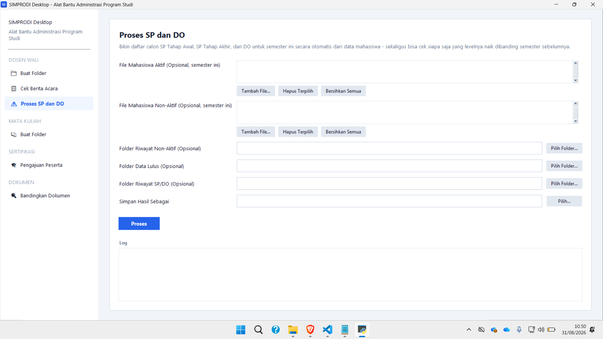
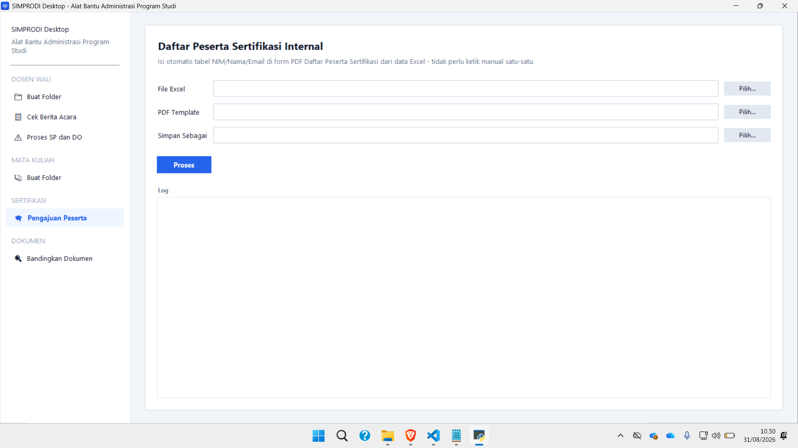
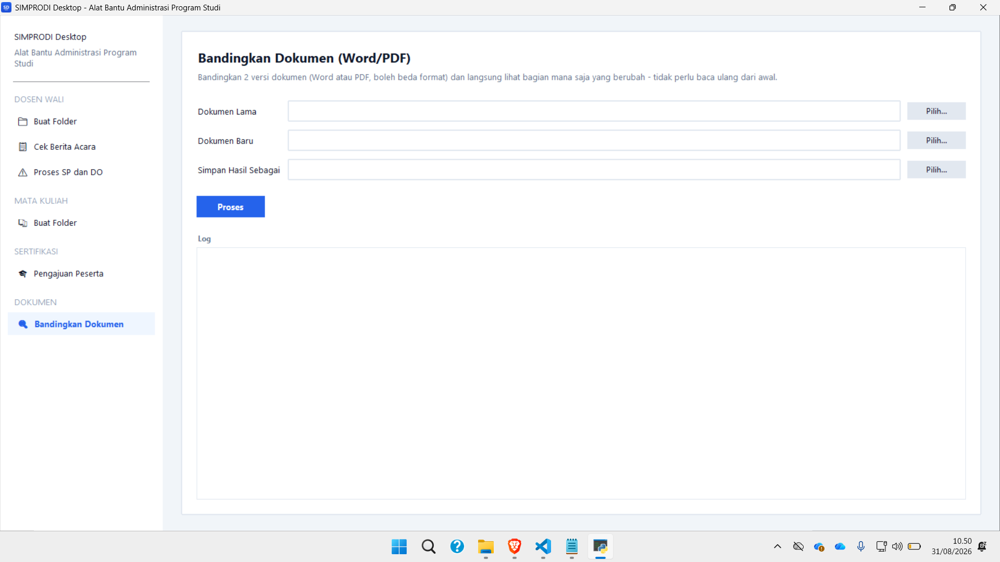

# 🖥️ SIMPRODI Desktop (Study Program Administration Toolkit)

SIMPRODI Desktop is a Windows desktop toolkit built for administrative staff of an academic study program (Program Studi). It automates recurring paperwork that used to be done by hand: generating academic-warning (SP) and dismissal (DO) letters from raw academic-export data, batch-creating advisor/course folders, filling in certification-participant PDF forms from Excel rosters, and diffing two versions of a document.

## ✨ Key Features

* **SP & DO Letter Generation:** Builds the SP Tahap Awal, SP Tahap Akhir, and DO candidate lists for the current semester straight from raw active/inactive/graduate student exports, applying the campus's academic-warning rules automatically.
* **Escalation Tracking:** Reads past semesters' SP/DO recap files (old or new sheet format, auto-detected) to show which students' warning level has escalated since last time, without relying on manually-typed "SP level" columns.
* **Auto-Generated Insights Sheet:** Every result file includes an "Infografis" sheet - a per-semester recap table and bar chart of Non-Active/Graduate/SP/DO counts, with short rule-based trend summaries.
* **Batch Folder Creation:** Creates one folder per advisor or per course from a pasted name list, skipping folders that already exist.
* **Certification Participant Form Filler:** Auto-fills the NIM/Name/Email table on the official certification-participant PDF form from an Excel export - no manual retyping.
* **Document Comparison:** Diffs two versions of a Word/PDF document and renders a side-by-side HTML report with word-level highlighting.
* **Offline & Portable:** Ships as a single standalone `.exe` - no installation, no internet connection required.

## 💻 Application Preview


*Batch-create advisor folders from a pasted name list.*


*Generate SP/DO warning letters and track escalation across semesters.*


*Auto-fill the certification-participant PDF form from an Excel roster.*


*Compare two document versions and highlight the differences.*

## 🛠️ Tech Stack

* **Language:** Python 3.11+
* **GUI:** Tkinter (`ttk`)
* **Data processing:** pandas, openpyxl, xlrd
* **PDF manipulation:** PyMuPDF (`fitz`)
* **Document diffing:** python-docx + PDF text extraction
* **Packaging:** PyInstaller (single-file Windows `.exe`)

## ⚙️ Installation & Setup

**For end users (recommended):** download `SIMPRODI Desktop.exe` from the [**latest release**](https://github.com/fandipres/simprodi-desktop/releases/latest) and double-click it. No installation needed - Windows may show an "unsigned app" warning on first run (click *More info* > *Run anyway*).

**For development, run from source:**

```bash
git clone https://github.com/fandipres/simprodi-desktop.git
cd simprodi-desktop
pip install -r requirements.txt
python app.py
```

**Build the standalone `.exe` yourself:**

```bash
pip install pyinstaller
pyinstaller --noconfirm "SIMPRODI Desktop.spec"
```

The output is generated at `dist/SIMPRODI Desktop.exe`.

## 📖 Documentation

The full user guide - step-by-step instructions per tool, the SP/DO warning rules, the `data/` folder conventions, and the MIKA export filters used as the data source - lives in [`Panduan Pengguna SIMPRODI Desktop.docx`](./Panduan%20Pengguna%20SIMPRODI%20Desktop.docx) in this repository (Indonesian).

## 🔗 Links

* **Download:** [Latest Release](https://github.com/fandipres/simprodi-desktop/releases/latest)
* **Repository:** [github.com/fandipres/simprodi-desktop](https://github.com/fandipres/simprodi-desktop)

## 📄 License

This is an internal administrative tool for an Informatics Engineering study program. Contact the project owner regarding usage or distribution.
